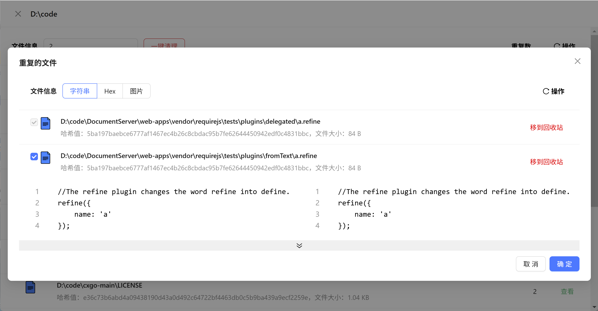

# 简洁、简单、轻量的文档查重，文件查重工具
## 1. 简介
Duplicate File Cleaner-是一个简洁、简单、轻量的文档查重，文件查重工具。它可以帮助用户快速查找和删除重复的文件和文档，提高工作效率。
## 2. 特性
- 不限文件格式，包括文本、PDF、Word、图片等等
- 支持多种查重算法，包括哈希算法、内容比对等
- 支持百万级别的文件查重，整盘查重，速度快，效率高，性能卓越
- 支持实时的可视化文件扫描交互
- 支持文件对比diff查看
- 支持一键清理重复文件到回收站
- 支持文件预览
- 软件永久免费
- 软件操作简单无学习成本

## 3. 使用教程
- 点击如下连接下载，下载后双击exe文件即可完成自动安装
- [Duplicate File Cleaner-1.0.0-win32-x64.exe](https://pan.baidu.com/s/1xr24zlO1e8Zee3to0eibyw?pwd=fykx)
- 选择目录，点击开始扫描，即可开始扫描，会显示当前扫描目录的文件数，重复文件数以及扫描进度，点击停止即可停止扫描，点击查看即可查询重复文件列表
- 点击一键清理即可全自动清理重复文件到回收站
- 搜索2即查看存在重复文件的文件，点击查看即可查看重复文件列表
- 默认选中2个文件进行diff对比，弹窗最下方显示对比结果，支持字符串对比，hex对比以及图片方式直接预览
- 点击移到回收站即可将选中的文件移到回收站
 

 

## 联系作者
微信: yuyi297341015
